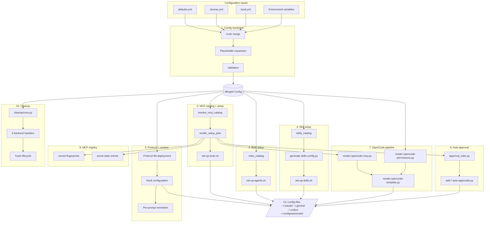
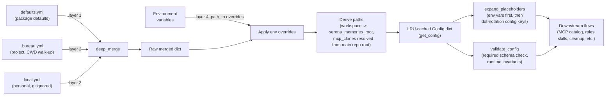
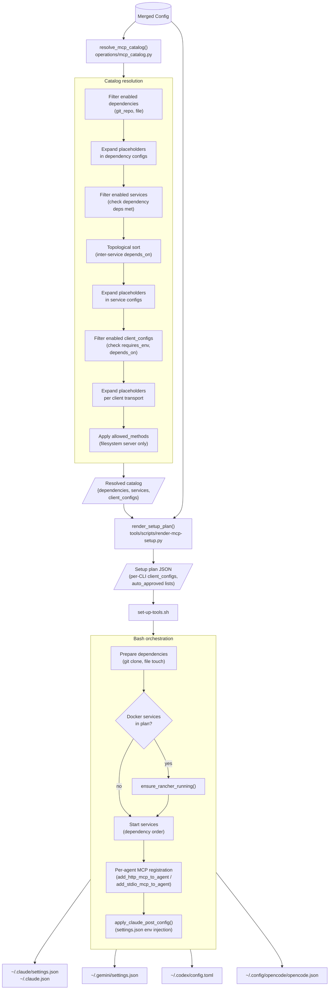
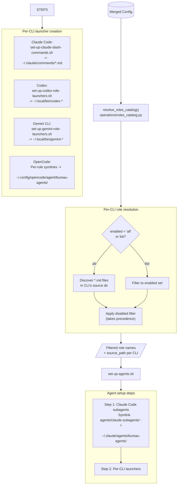
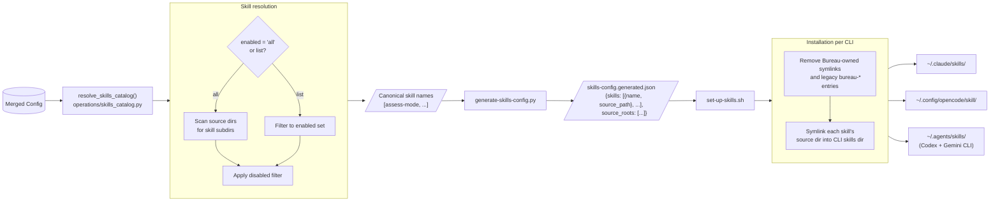
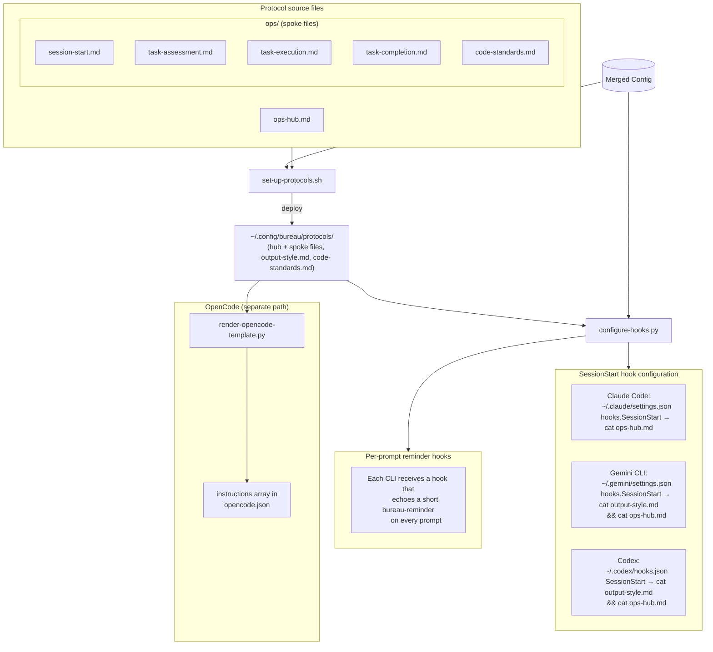
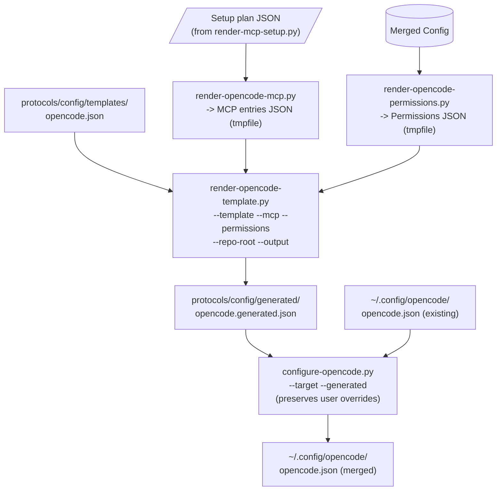
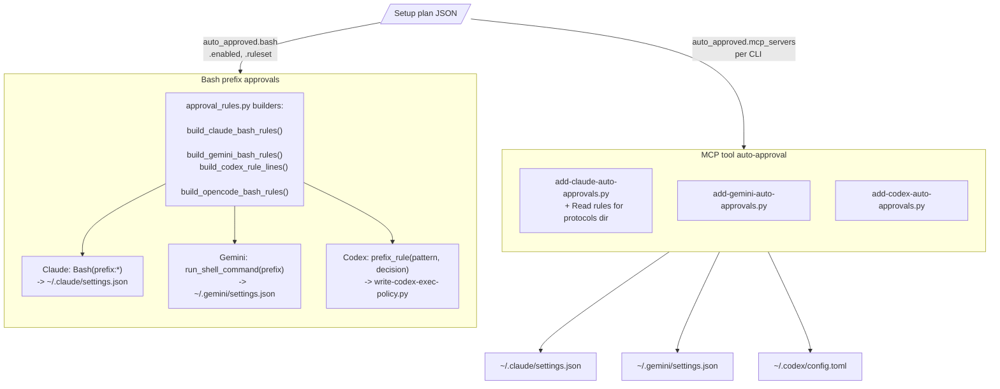
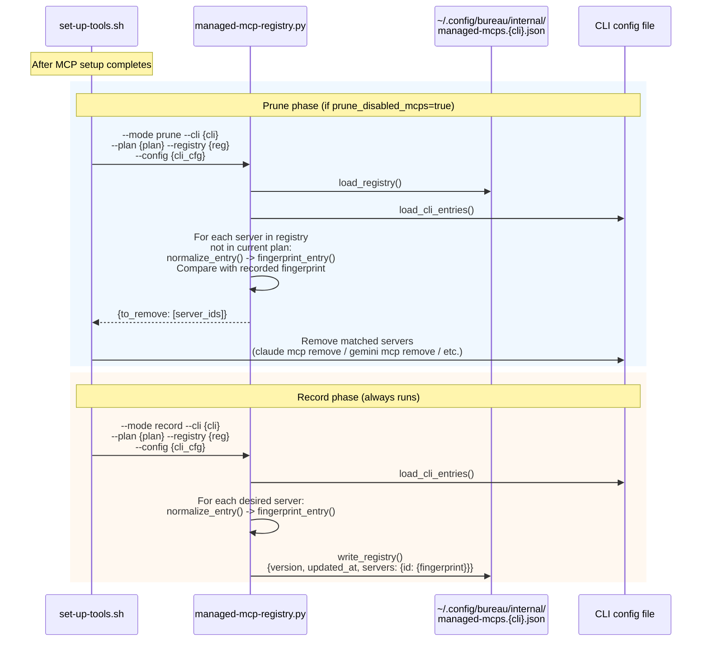
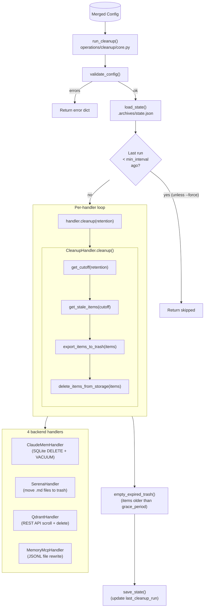

# Data flows

> End-to-end traces of every data flow in Bureau, from configuration inputs to CLI outputs.

Each section contains:

1. **Prose overview** (hand-written) -- what the flow does and why it exists
2. **Mermaid diagram** (hand-written) -- visual trace of data movement
3. **Function-level detail table** (generated) -- extracted from structured docstrings by `scripts/extract-flow-docs.py`

Generated tables are inserted at `<!-- GENERATED:... -->` markers by the extraction script. Do not edit content between `<!-- GENERATED:... -->` and `<!-- /GENERATED -->` markers by hand.

---

***Contents***

- [System overview](#system-overview)
- [Conventions and legend](#conventions-and-legend)
- [1. Config resolution](#1-config-resolution)
- [2. MCP catalog and setup](#2-mcp-catalog-and-setup)
- [3. Role setup](#3-role-setup)
- [4. Skill setup](#4-skill-setup)
- [5. Protocol and context setup](#5-protocol-and-context-setup)
- [7. OpenCode pipeline](#7-opencode-pipeline)
- [8. Auto-approval configuration](#8-auto-approval-configuration)
- [9. MCP registry management](#9-mcp-registry-management)
- [10. Cleanup system](#10-cleanup-system)
- [Generated table format](#generated-table-format)

---

## System overview

Bureau's `open-bureau` entrypoint orchestrates all flows in a fixed sequence. The diagram below shows the relationships between flows and the data that passes between them.

---

## Conventions and legend

**Diagram conventions used throughout this document:**

| Symbol | Meaning |
|:-------|:--------|
| Rounded rectangle | Processing step (function or script) |
| Cylinder / database shape | Persistent data store |
| Parallelogram | File on disk (config, generated artifact) |
| Diamond | Decision / conditional branch |
| Dashed border | Optional / conditional path |
| Arrow label | Data format or key being passed |

**CLI abbreviations:**

| Abbreviation | Full name |
|:-------------|:----------|
| CC | Claude Code |
| GC | Gemini CLI |
| CX | Codex |
| OC | OpenCode |

**File location shorthand:**

| Shorthand | Expands to |
|:----------|:-----------|
| `~/.claude/` | User-scoped Claude Code config directory |
| `~/.gemini/` | User-scoped Gemini CLI config directory |
| `~/.codex/` | User-scoped Codex config directory |
| `~/.config/opencode/` | User-scoped OpenCode config directory |
| `~/.config/bureau/` | Bureau's user-scoped state directory |

---

## 1. Config resolution

Bureau loads configuration from four sources in a strict merge order. Later sources override earlier ones. After merging, placeholders are expanded and the result is validated before any downstream flow consumes it.

**Key details:**

- `find_project_config()` walks up from CWD to locate `.bureau.yml`, skipping the Bureau repo root itself
- `deep_merge()` recursively merges dicts; non-dict values are replaced wholesale (lists are not merged)
- `expand_placeholders()` loops until a fixed point (no new expansions), with env vars taking priority over config key paths
- Config is LRU-cached (`@lru_cache(maxsize=1)`) and cleared via `clear_config_cache()` for testing

**Cross-references:** All subsequent flows consume the output of this flow via `get_config()` or its convenience accessors.

<!-- GENERATED:config-resolution -->
<!-- /GENERATED -->

---

## 2. MCP catalog and setup

The MCP catalog resolves which dependencies, runtime services, and client configs are active, then a setup plan JSON drives the bash orchestration script that provisions Docker containers, HTTP processes, and per-CLI MCP entries.

**Key details:**

- `render_setup_plan()` fans out `client_configs` into per-CLI dicts, respecting `disabled_for` and per-CLI client overrides (with `default` as fallback)
- Service startup order is determined by topological sort on `depends_on.services` edges
- Each per-CLI MCP addition is idempotent: existing entries are skipped (grep-based detection)
- Codex HTTP transport does not support custom headers; servers requiring headers must use `stdio` for Codex

**Cross-references:** [9. MCP registry management](#9-mcp-registry-management) records fingerprints after this flow completes. [7. OpenCode pipeline](#7-opencode-pipeline) uses the setup plan for OpenCode-specific rendering. [8. Auto-approval configuration](#8-auto-approval-configuration) uses the setup plan's `auto_approved` lists.

<!-- GENERATED:mcp-catalog-setup -->
<!-- /GENERATED -->

---

## 3. Role setup

The role system resolves which agent roles are enabled per CLI, then wires them into the correct filesystem locations: slash commands for Claude Code, launcher scripts for Codex/Gemini, and filtered symlinks for OpenCode.

**Key details:**

- Two distinct source directories: `agents/claude-subagents/` (Claude-specific, with frontmatter) and `agents/role-prompts/` (all other CLIs)
- `disabled` list always takes precedence over `enabled` (even when `enabled: all`)
- OpenCode uses individually symlinked role files (not a directory symlink) to respect per-role filtering
**Cross-references:** None.

<!-- GENERATED:role-setup -->
<!-- /GENERATED -->

---

## 4. Skill setup

Skills are structured multi-step protocols (e.g., `assess-mode`) that agents activate automatically when they recognise a matching task. The skill flow resolves which skills are enabled, generates a JSON config, then installs symlinks into each CLI's user-scoped skills directory.

**Key details:**

- Bureau removes only symlinks it owns at canonical names, plus legacy `bureau-*` entries left by older installs
- Skills are installed as symlinks pointing back to `protocols/context/static/skills/<skill-name>/` in the repo
- Each skill directory must contain a `SKILL.md` file (the protocol definition the agent reads)

**Cross-references:** [5. Protocol and context setup](#5-protocol-and-context-setup) is the parent script that calls skill setup.

<!-- GENERATED:skill-setup -->
<!-- /GENERATED -->

---

## 5. Protocol and context setup

This flow deploys protocol files (hub + spokes) to the user-scoped protocols directory, then configures SessionStart hooks in each CLI's settings so that agents receive Bureau context at the start of every session. Per-prompt reminder hooks are also installed. OpenCode uses a separate path via its native `instructions` array.

**Key details:**

- `set-up-protocols.sh` deploys hub + spoke files to `~/.config/bureau/protocols/`; default files are copied only on first run (when directory is empty or absent)
- `configure-hooks.py` writes SessionStart hooks into each CLI's settings, causing agents to `cat` the relevant protocol files at session start
- Per-prompt hooks echo a short `<bureau-reminder>` on every prompt to reinforce key directives
- OpenCode uses its native `instructions` array (populated by `render-opencode-template.py`) rather than hooks
- `bin/reset-protocols` restores defaults by re-copying from `protocols/context/static/`

**Cross-references:** This script also calls [4. Skill setup](#4-skill-setup) as a sub-step.

<!-- GENERATED:protocol-context-setup -->
<!-- /GENERATED -->

---

## 7. OpenCode pipeline

OpenCode requires a distinct configuration format. Three rendering scripts produce the MCP server entries, permission rules, and merged template that become OpenCode's `opencode.json`.

**Key details:**

- Rendering uses tmpfiles for intermediate JSON to avoid polluting the repo
- `configure-opencode.py` preserves user-added overrides while reconciling Bureau-managed `instructions` and `agent` entries in the existing `opencode.json`
- If any rendering step fails, the existing `opencode.json` is left unchanged (fail-safe)
- OpenCode MCP entries use `type: "remote"` (for HTTP) and `type: "local"` (for stdio), distinct from other CLIs

**Cross-references:** [2. MCP catalog and setup](#2-mcp-catalog-and-setup) produces the setup plan consumed here. [9. MCP registry management](#9-mcp-registry-management) records OpenCode's entries after this flow completes.

<!-- GENERATED:opencode-pipeline -->
<!-- /GENERATED -->

---

## 8. Auto-approval configuration

Each CLI has its own permission format for auto-approving MCP tool invocations and bash command prefixes. This flow translates a common input (the setup plan's approval lists) into per-CLI permission strings.

**Key details:**

- MCP auto-approval writes server names as `autoApprovedTools` (Claude/Gemini JSON) or config entries (Codex TOML)
- Claude also gets a `Read(~/.config/bureau/protocols/**)` rule for the protocols directory
- Bash rules use prefix matching only (no wildcards); if a prefix appears in both allow and deny, the CLI's native precedence applies (deny wins)
- All builders are idempotent: duplicate rules are not appended

**Cross-references:** [2. MCP catalog and setup](#2-mcp-catalog-and-setup) drives MCP approval lists. [1. Config resolution](#1-config-resolution) provides the `auto_approved` config section.

<!-- GENERATED:auto-approval-config -->
<!-- /GENERATED -->

---

## 9. MCP registry management

Bureau tracks which MCP servers it manages per CLI using fingerprint-based registry files. This enables safe pruning of entries that Bureau previously installed but are no longer desired, without touching user-modified entries.

**Key details:**

- Fingerprints are SHA-256 hashes of normalized, JSON-serialized entry configs (sorted keys, compact separators)
- Normalization extracts a transport-agnostic representation per CLI (e.g., Claude's `type` field maps to `transport`)
- A server is only pruned if its current config fingerprint matches the recorded one (user modifications protect the entry)
- Registry files live at `~/.config/bureau/internal/managed-mcps.{cli}.json`

**Cross-references:** [2. MCP catalog and setup](#2-mcp-catalog-and-setup) calls prune before MCP registration and record after.

<!-- GENERATED:mcp-registry-management -->
<!-- /GENERATED -->

---

## 10. Cleanup system

Bureau's cleanup system uses an abstract handler pattern with four storage-specific backends. It runs automatically on `open-bureau` if enough time has passed, or manually via `uv run sweep`.

**Key details:**

- `CleanupHandler` is the abstract base class; subclasses implement `get_stale_items()`, `export_items_to_trash()`, `delete_items_from_storage()`, and `_wipe()`
- Retention is per-backend (from `retention_period_for` config); `"always"` skips cleanup for that backend
- Deleted items go to `.archives/trash/` with a configurable grace period before permanent deletion
- The `wipe` command (`uv run sweep --wipe <storage>`) is a separate code path that erases all data (optionally with backup)
- `CleanupError` is the expected exception type; raw exceptions are caught and reported as error dicts

**Cross-references:** [1. Config resolution](#1-config-resolution) provides retention periods and paths.

<!-- GENERATED:cleanup-system -->
<!-- /GENERATED -->

---

## Generated table format

The extraction script (`scripts/extract-flow-docs.py`) produces tables with the following columns for each function entry:

| Column | Description |
|:-------|:-----------|
| **Function** | Fully qualified name (e.g., `operations.mcp_catalog.resolve_mcp_catalog`) |
| **Module** | Source file relative to repo root |
| **Signature** | Parameter names and types (from type hints) |
| **Purpose** | First line of the docstring |
| **Inputs** | Parameters with their types and brief descriptions (from docstring Args section) |
| **Output** | Return type and description (from docstring Returns section) |
| **Side effects** | File writes, network calls, state mutations (from docstring or annotation) |
| **Called by** | Parent function(s) or script(s) that invoke this function |
| **Calls** | Child function(s) this function invokes |
| **Flow** | Which data flow section(s) this function participates in |

Tables are sorted by call order within each flow section.

**Example generated row:**

| Function | Module | Signature | Purpose | Inputs | Output | Side effects | Called by | Calls | Flow |
|:---------|:-------|:----------|:--------|:-------|:-------|:-------------|:---------|:------|:-----|
| `resolve_mcp_catalog` | `operations/mcp_catalog.py` | `(config: Mapping, env: Mapping \| None) -> dict` | Resolve enabled MCP entries from catalog config | `config`: merged Bureau config; `env`: environment variables | Dict with `dependencies`, `client_configs`, `services` | None | `render_setup_plan()` | `expand_placeholders()`, `_apply_allowed_methods()` | MCP catalog + setup |
